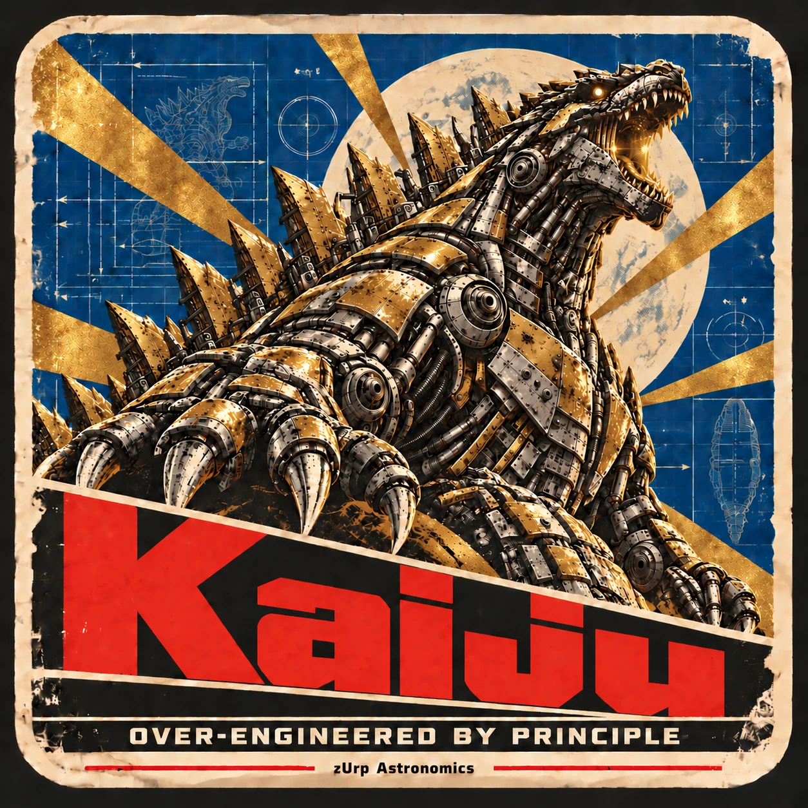

<!-- zurp-readme-header:begin — paste this block once, never again: the poster and the badges update themselves at each build of the site — do not edit it -->

<!-- zurp-readme-header:end -->

<h1 align="center">Kaiju</h1>

<strong><em>Over-engineered by principle.</em></strong>

  <a href="https://zurp-astronomics.github.io/kaiju/">Website</a> ·
  <a href="7_Docs/">Documentation</a> ·
  <a href="../../releases">Releases</a> ·
  <a href="https://github.com/zUrp-Astronomics">zUrp Astronomics</a>

---

## 🚧 Work in progress — do not build yet 🚧

**Nothing here is validated on real hardware.** 
Files change without notice, and what you build today may need rework tomorrow. 
👀 Watch the repository to know when the first release lands.

---

## Why Kaiju?

Smart telescopes are cute: sealed plastic, a tiny sensor behind a tiny lens, and an app that tells
you what you are allowed to do. **Kaiju takes the same all-in-one idea and removes every limit.**
A harmonic alt-az head with an **Intel N100** inside — a real computer, not a toy chip — carrying a
**Samyang AF 135 mm f/1.8** and an **APS-C camera**. It is built to crush the plastic boxes, not to
compete with them.

Kaiju is where the whole zUrp bestiary ends up. About 5,000 hours of astro tinkering, condensed into
one machine — glorious and shiny, but made the low-tech way: it smells of cold coffee, solder flux and
a 3D printer that hasn't cooled down in weeks. The one cave we refuse to enter is grinding glass. For
everything else, buying is cheating.

## At a glance

| | |
|---|---|
| Head | harmonic alt-az |
| Brain | Intel N100 |
| Optics | Samyang AF 135 mm f/1.8 |
| Camera | APS-C |

## The bestiary inside

| Role | Product |
|---|---|
| Behind the glass | [Maelstrom](https://github.com/zUrp-Astronomics/Maelstrom) — APS-C cooled camera |
| Driving the lens | [Basilisk](https://github.com/zUrp-Astronomics/Basilisk) — Sony E adapter |
| Feeding the power | [Kraken](https://github.com/zUrp-Astronomics/Kraken) — powerbox |
| Moving the axes | [Unicorn](https://github.com/zUrp-Astronomics/Unicorn) — mount controller |

Kaiju itself is a purely mechanical project: this repository holds no board, firmware or software.

## Status & roadmap

The mechanics are being designed: the folders of this repository are in place, and they hold no
part files yet.

## Repository layout

| Folder | Contents |
|---|---|
| [`0_Datasheets/`](0_Datasheets/) | datasheets of the mechanical components and purchased modules (the electronics' live in Unicorn) |
| [`2_Hardware/`](2_Hardware/) | mechanics outside the board: enclosure, parts, design sources, mechanical BoM |
| [`3_3D-Models/`](3_3D-Models/) | ready-to-print files |
| [`7_Docs/`](7_Docs/) | documentation: manual, protocol, design notes |
| [`8_References/`](8_References/) | external reference documents: what the project reads, not what it produces |
| [`9_Assets/`](9_Assets/) | the showcase: product sheet, poster and README images |

## License

- **Hardware design** — boards, mechanics and 3D models: [Open Community License v1.1](LICENSE-HARDWARE).
- **Everything else** — firmware, software, documentation and images: [GNU GPL v3.0](LICENSE).

Third-party material keeps its own licence:

- the datasheets in `0_Datasheets/` and the documents in `8_References/` belong to their authors.

---

<a href="https://zurp-astronomics.github.io/">zUrp Astronomics</a> — a subsidiary of zUrp Industries. Because buying is cheating.

